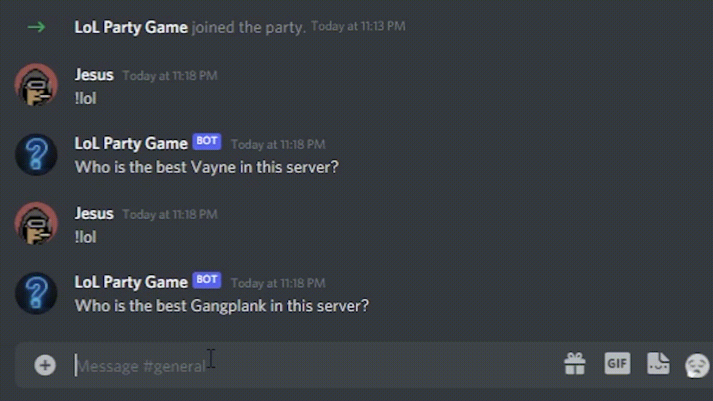

# LoL Party Game - Discord Bot
- Discord bot that asks, "Who is the best {champ_name} player in this server?" 
- Great game if you want to argue and have a laugh with your friends! 

Special thanks to Michiel Mulder's Discord Bot repo: [https://github.com/michielmulders/discord-bot-sitepoint](https://github.com/michielmulders/discord-bot-sitepoint)

## How to play

1. Use `!lol`
2. Argue :joy:

## Requirements

- [Node.js](http://nodejs.org/)
- [Discord](https://discordapp.com/) account

## Installation Steps (if applicable)

1. Clone repo
2. Run `npm install`
3. Add Discord credentials to the `.env` file
3. Run `node index.js`
4. Interact with your Discord bot via your web browser

## Ways you can modify this

1. You can change the `champs.json` file to characters from a different game
2. You can change it from "best" to "worst"
3. Any other way you can think of

## License

MIT license
Copyright - 2022 Jesus Yanez

Permission is hereby granted, free of charge, to any person obtaining
a copy of this software and associated documentation files (the
"Software"), to deal in the Software without restriction, including
without limitation the rights to use, copy, modify, merge, publish,
distribute, sublicense, and/or sell copies of the Software, and to
permit persons to whom the Software is furnished to do so, subject to
the following conditions:

The above copyright notice and this permission notice shall be
included in all copies or substantial portions of the Software.

THE SOFTWARE IS PROVIDED "AS IS", WITHOUT WARRANTY OF ANY KIND,
EXPRESS OR IMPLIED, INCLUDING BUT NOT LIMITED TO THE WARRANTIES OF
MERCHANTABILITY, FITNESS FOR A PARTICULAR PURPOSE AND
NONINFRINGEMENT. IN NO EVENT SHALL THE AUTHORS OR COPYRIGHT HOLDERS BE
LIABLE FOR ANY CLAIM, DAMAGES OR OTHER LIABILITY, WHETHER IN AN ACTION
OF CONTRACT, TORT OR OTHERWISE, ARISING FROM, OUT OF OR IN CONNECTION
WITH THE SOFTWARE OR THE USE OR OTHER DEALINGS IN THE SOFTWARE.
